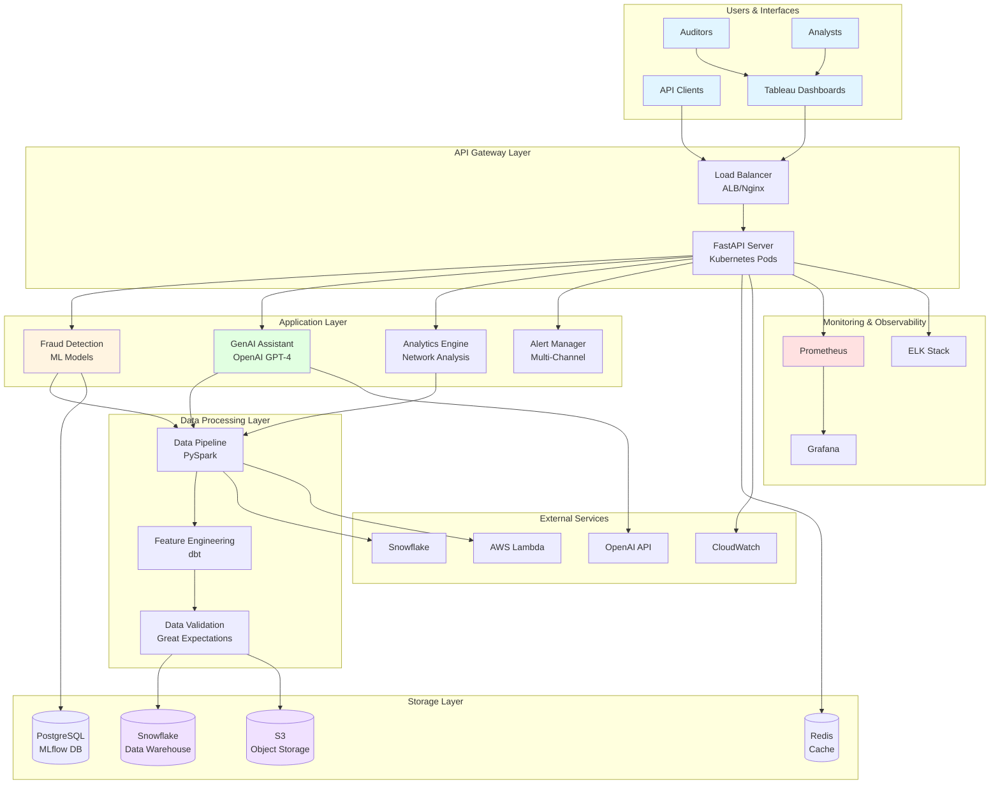
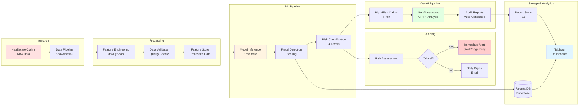
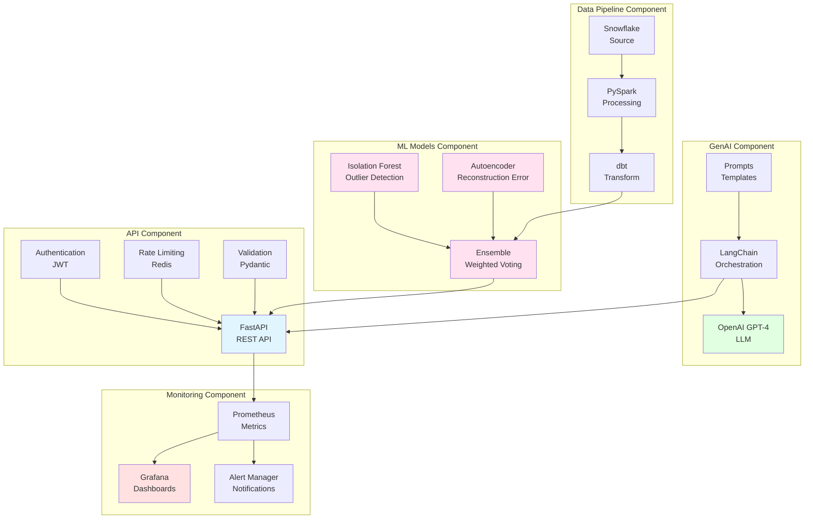
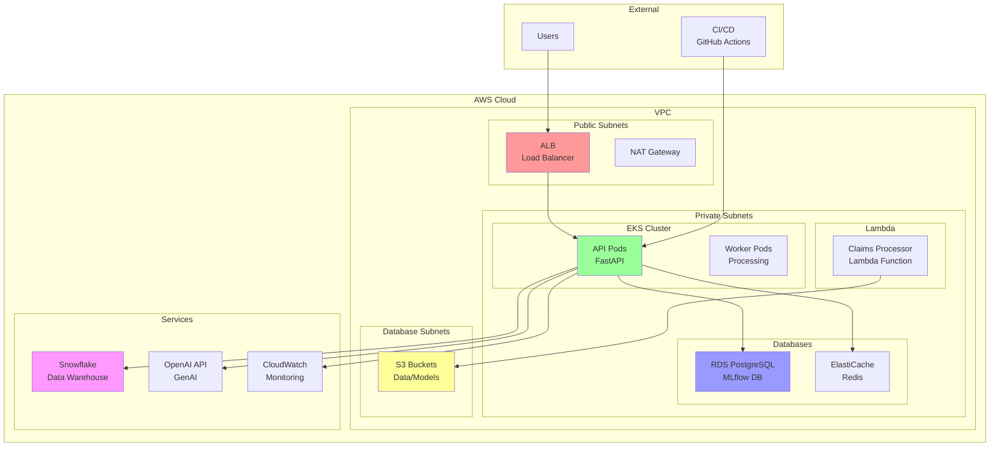
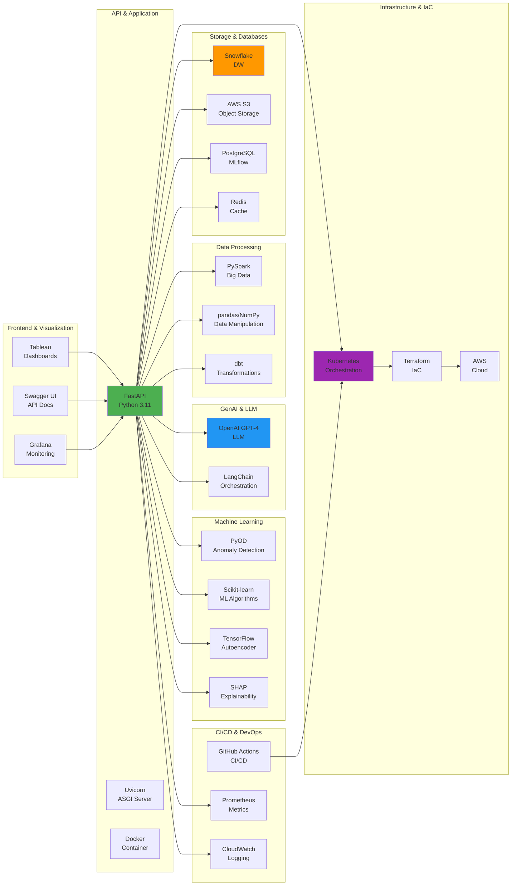
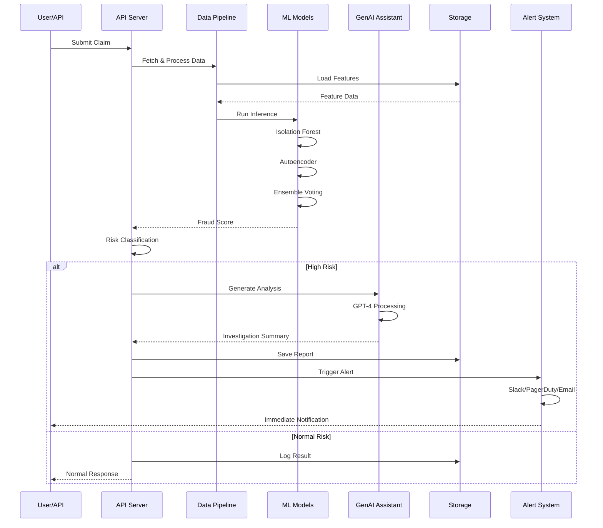
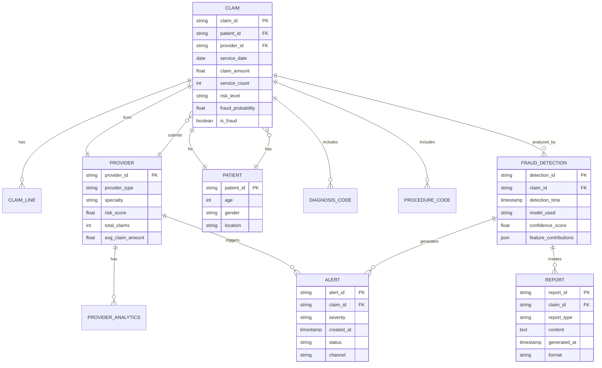
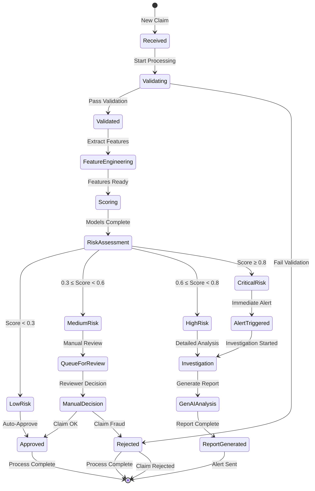
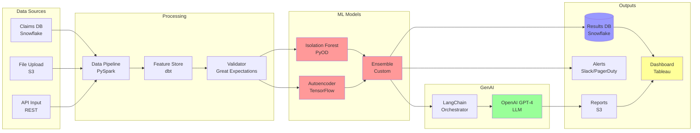

# Healthcare Fraud Detection System - Architecture Diagrams

## Table of Contents
1. [High-Level System Architecture](#high-level-system-architecture)
2. [Data Flow Architecture](#data-flow-architecture)
3. [Component Architecture](#component-architecture)
4. [Deployment Architecture](#deployment-architecture)
5. [Technology Stack Architecture](#technology-stack-architecture)

---

## High-Level System Architecture



---

## Data Flow Architecture



---

## Component Architecture



---

## Deployment Architecture



---

## Technology Stack Architecture



---

## Sequence Diagram - Fraud Detection Flow



---

## Entity Relationship Diagram



---

## State Diagram - Claim Processing



---

## ASCII Architecture Diagrams

### System Architecture (ASCII)

```
┌─────────────────────────────────────────────────────────────────────────────────┐
│                          USER INTERFACE LAYER                                   │
│  ┌──────────────┐  ┌──────────────┐  ┌──────────────┐  ┌──────────────┐       │
│  │   Tableau    │  │  Web Portal  │  │ REST API     │  │  Mobile App  │       │
│  │  Dashboards  │  │              │  │  (FastAPI)   │  │              │       │
│  └──────────────┘  └──────────────┘  └──────────────┘  └──────────────┘       │
└─────────────────────────────────────────────────────────────────────────────────┘
                                        │
                                        ▼
┌─────────────────────────────────────────────────────────────────────────────────┐
│                          API GATEWAY LAYER                                      │
│                     ┌─────────────────────────┐                                │
│                     │  Load Balancer (ALB)    │                                │
│                     │  + Rate Limiting         │                                │
│                     │  + SSL/TLS              │                                │
│                     │  + Authentication        │                                │
│                     └─────────────────────────┘                                │
└─────────────────────────────────────────────────────────────────────────────────┘
                                        │
                                        ▼
┌─────────────────────────────────────────────────────────────────────────────────┐
│                          APPLICATION LAYER                                      │
│  ┌──────────────────────────────────────────────────────────────────────────┐  │
│  │                    Kubernetes (EKS)                                       │  │
│  │                                                                         │  │
│  │  ┌──────────────┐  ┌──────────────┐  ┌──────────────┐                   │  │
│  │  │   API Pods   │  │  Worker Pods │  │  Cron Jobs   │                   │  │
│  │  │   (FastAPI)  │  │ (Processing) │  │ (Scheduled)  │                   │  │
│  │  │              │  │              │  │              │                   │  │
│  │  │  - Auto-scal│  │  - Batch proc│  │  - Retraining│                   │  │
│  │  │  - 3 replicas│  │  - Async jobs│  │  - Reports   │                   │  │
│  │  └──────────────┘  └──────────────┘  └──────────────┘                   │  │
│  │                                                                         │  │
│  └──────────────────────────────────────────────────────────────────────────┘  │
└─────────────────────────────────────────────────────────────────────────────────┘
                                        │
                ┌───────────────────────┼───────────────────────┐
                ▼                       ▼                       ▼
┌───────────────────────┐ ┌───────────────────────┐ ┌───────────────────────┐
│  ML INFERENCE LAYER   │ │   GENAI LAYER        │ │  ANALYTICS LAYER      │
│                       │ │                       │ │                       │
│ ┌─────────────────┐   │ │ ┌─────────────────┐   │ │ ┌─────────────────┐   │
│ │ Isolation Forest │   │ │ │   OpenAI GPT-4  │   │ │ │  Network Graph  │   │
│ │   (PyOD)        │   │ │ │                 │   │ │ │   Analysis     │   │
│ └─────────────────┘   │ │ └─────────────────┘   │ │ └─────────────────┘   │
│ ┌─────────────────┐   │ │ ┌─────────────────┐   │ │ ┌─────────────────┐   │
│ │   Autoencoder   │   │ │ │   LangChain     │   │ │ │  Provider       │   │
│ │  (TensorFlow)   │   │ │ │                 │   │ │ │  Scoring        │   │
│ └─────────────────┘   │ │ └─────────────────┘   │ │ └─────────────────┘   │
│ ┌─────────────────┐   │ │ ┌─────────────────┐   │ │ ┌─────────────────┐   │
│ │    Ensemble     │   │ │ │  Prompt Mgr     │   │ │ │  Pattern        │   │
│ │  (Weighted)     │   │ │ │                 │   │ │ │  Detection      │   │
│ └─────────────────┘   │ │ └─────────────────┘   │ │ └─────────────────┘   │
└───────────────────────┘ └───────────────────────┘ └───────────────────────┘
                │                       │                       │
                └───────────────────────┼───────────────────────┘
                                        ▼
┌─────────────────────────────────────────────────────────────────────────────────┐
│                          DATA LAYER                                             │
│  ┌──────────────┐  ┌──────────────┐  ┌──────────────┐  ┌──────────────┐       │
│  │  Snowflake   │  │     S3       │  │  PostgreSQL  │  │    Redis     │       │
│  │  (Warehouse) │  │  (Storage)   │  │   (MLflow)   │  │    (Cache)   │       │
│  │              │  │              │  │              │  │              │       │
│  │ - Claims     │  │ - Models     │  │ - Experiments│  │ - Sessions   │       │
│  │ - Features   │  │ - Reports    │  │ - Metrics    │  │ - Query Cache│       │
│  │ - Results    │  │ - Data       │  │ - Artifacts  │  │              │       │
│  └──────────────┘  └──────────────┘  └──────────────┘  └──────────────┘       │
└─────────────────────────────────────────────────────────────────────────────────┘
                                        │
                                        ▼
┌─────────────────────────────────────────────────────────────────────────────────┐
│                    MONITORING & ALERTING LAYER                                   │
│  ┌──────────────┐  ┌──────────────┐  ┌──────────────┐  ┌──────────────┐       │
│  │  Prometheus  │  │   Grafana    │  │  CloudWatch  │  │   Alert Mgr  │       │
│  │  (Metrics)   │  │ (Dashboards) │  │   (Logs)     │  │ (Multi-Chnl) │       │
│  └──────────────┘  └──────────────┘  └──────────────┘  └──────────────┘       │
│                            │                       │                          │
│                            ▼                       ▼                          │
│                    ┌──────────────┐       ┌──────────────┐                    │
│                    │     Slack    │       │   PagerDuty  │                    │
│                    └──────────────┘       └──────────────┘                    │
└─────────────────────────────────────────────────────────────────────────────────┘
```

### Data Flow (ASCII)

```
┌─────────────┐
│ Raw Claims  │
│   (CSV/DB)  │
└──────┬──────┘
       │
       ▼
┌─────────────────────────────────────────────────────────────┐
│                    DATA INGESTION                           │
│  ┌──────────────┐  ┌──────────────┐  ┌──────────────┐      │
│  │   Snowflake  │  │  S3 Upload   │  │  API Ingest   │      │
│  │     Bulk     │  │              │  │              │      │
│  └──────────────┘  └──────────────┘  └──────────────┘      │
└──────────────────────────┬──────────────────────────────────┘
                           │
                           ▼
┌─────────────────────────────────────────────────────────────┐
│                DATA PROCESSING PIPELINE                      │
│                                                             │
│  Raw Data ──► Validation ──► Cleaning ──► Enrichment        │
│                  │               │            │               │
│                  ▼               ▼            ▼               │
│            Quality Checks   Dedup    Feature Engineering      │
│                                                  │            │
│                                                  ▼            ▼
│  ┌──────────────────────────────────────────────────────┐    │
│  │              FEATURE ENGINEERING                     │    │
│  │  ┌────────────┐  ┌────────────┐  ┌────────────┐     │    │
│  │  │ Numerical  │  │ Categorical│  │  Derived   │     │    │
│  │  │ Features   │  │ Encoding   │  │  Features   │     │    │
│  │  └────────────┘  └────────────┘  └────────────┘     │    │
│  └──────────────────────────────────────────────────────┘    │
└──────────────────────────┬──────────────────────────────────┘
                           │
                           ▼
┌─────────────────────────────────────────────────────────────┐
│                    ML INFERENCE                              │
│                                                             │
│  Feature Vector ──► Preprocessing ──► Model Selection        │
│                                      │                      │
│                                      ▼                      │
│                        ┌─────────────────────────┐           │
│                        │    ENSEMBLE MODELS      │           │
│                        │                        │           │
│                        │  ┌────────────────┐     │           │
│                        │  │ Isolation Forest│     │           │
│                        │  └────────────────┘     │           │
│                        │           │            │           │
│                        │  ┌────────────────┐     │           │
│                        │  │   Autoencoder   │     │           │
│                        │  └────────────────┘     │           │
│                        │           │            │           │
│                        │           ▼            │           │
│                        │  ┌────────────────┐     │           │
│                        │  │    Ensemble     │     │           │
│                        │  │ (Weighted Avg) │     │           │
│                        │  └────────────────┘     │           │
│                        └─────────────────────────┘           │
└──────────────────────────┬──────────────────────────────────┘
                           │
                           ▼
                    Fraud Score
                    Risk Level
                     (0.0-1.0)
                           │
        ┌──────────────────┼──────────────────┐
        ▼                  ▼                  ▼
   Low Risk        Medium Risk      High/Critical
        │                  │                  │
        ▼                  ▼                  ▼
   Auto-Approve      Manual Review      Investigation
        │                  │                  │
        ▼                  ▼                  ▼
   Payment          Review Decision    GenAI Analysis
                                             │
                                             ▼
                                      Audit Report
                                             │
                                          Alerts
                                             │
                                    ┌───────┴───────┐
                                    ▼               ▼
                                 Slack        PagerDuty
```

### Deployment Architecture (ASCII)

```
┌─────────────────────────────────────────────────────────────────────────────────┐
│                           AWS CLOUD                                            │
│                                                                                  │
│  ┌──────────────────────────────────────────────────────────────────────┐    │
│  │                            VPC                                       │    │
│  │                                                                       │    │
│  │  ┌─────────────────────────────────────────────────────────────┐    │    │
│  │  │                      Public Subnets                          │    │    │
│  │  │  ┌──────────────┐  ┌──────────────┐  ┌──────────────┐      │    │    │
│  │  │  │  ALB / NGINX │  │  NAT Gateway │  │  Bastion Host │      │    │    │
│  │  │  │              │  │              │  │              │      │    │    │
│  │  │  └──────────────┘  └──────────────┘  └──────────────┘      │    │    │
│  │  └─────────────────────────────────────────────────────────────┘    │    │
│  │                                                                       │    │
│  │  ┌─────────────────────────────────────────────────────────────┐    │    │
│  │  │                     Private Subnets                          │    │    │
│  │  │                                                             │    │    │
│  │  │  ┌─────────────────────────────────────────────────────┐   │    │    │
│  │  │  │              EKS Cluster (Kubernetes)                │   │    │    │
│  │  │  │                                                         │   │    │    │
│  │  │  │  ┌──────────────────┐  ┌──────────────────┐           │   │    │    │
│  │  │  │  │   Control Plane  │  │   Worker Nodes   │           │   │    │    │
│  │  │  │  │                  │  │                   │           │   │    │    │
│  │  │  │  │  - etcd          │  │  ┌────────────┐  │           │   │    │    │
│  │  │  │  │  - API Server     │  │  │ API Pods   │  │           │   │    │    │
│  │  │  │  │  - Scheduler     │  │  │            │  │           │   │    │    │
│  │  │  │  │  - Controller    │  │  │ Worker Pods│  │           │   │    │    │
│  │  │  │  │                  │  │  │            │  │           │   │    │    │
│  │  │  │  └──────────────────┘  │  └────────────┘  │           │   │    │    │
│  │  │  │                         │  (Auto-scaling)  │           │   │    │    │
│  │  │  └─────────────────────────────────────────────┘           │   │    │    │
│  │  │                                                             │   │    │    │
│  │  │  ┌─────────────────────────────────────────────────────┐   │   │    │    │
│  │  │  │              AWS Lambda Functions                    │   │   │    │    │
│  │  │  │  ┌──────────────────────────────────────────────┐   │   │   │    │    │
│  │  │  │  │  Claims Processor                              │   │   │   │    │    │
│  │  │  │  │  - Serverless processing                        │   │   │   │    │    │
│  │  │  │  │  - S3 event triggers                            │   │   │   │    │    │
│  │  │  │  │  - Async processing                             │   │   │   │    │    │
│  │  │  │  └──────────────────────────────────────────────┘   │   │   │    │    │
│  │  │  └─────────────────────────────────────────────────────┘   │   │    │    │
│  │  │                                                             │   │    │    │
│  │  │  ┌─────────────────────────────────────────────────────┐   │   │    │    │
│  │  │  │              Databases & Storage                     │   │   │    │    │
│  │  │  │                                                         │   │    │    │
│  │  │  │  ┌──────────────┐  ┌──────────────┐  ┌────────────┐  │   │   │    │    │
│  │  │  │  │ RDS          │  │ ElastiCache  │  │   S3       │  │   │   │    │    │
│  │  │  │  │ PostgreSQL   │  │ Redis        │  │ Buckets    │  │   │   │    │    │
│  │  │  │  │              │  │              │  │            │  │   │   │    │    │
│  │  │  │  │ - MLflow DB  │  │ - Cache      │  │ - Data     │  │   │   │    │    │
│  │  │  │  │ - User Data  │  │ - Sessions   │  │ - Models   │  │   │   │    │    │
│  │  │  │  └──────────────┘  └──────────────┘  │ - Reports  │  │   │   │    │    │
│  │  │  │                                        │ - Logs     │  │   │   │    │    │
│  │  │  │                                        └────────────┘  │   │   │    │    │
│  │  │  └─────────────────────────────────────────────────────┘   │   │    │    │
│  │  └─────────────────────────────────────────────────────────────┘   │    │    │
│  │                                                                       │    │
│  │  ┌─────────────────────────────────────────────────────────────┐    │    │
│  │  │                   Database Subnets                           │    │    │
│  │  │  ┌──────────────┐  ┌──────────────┐                        │    │    │
│  │  │  │   Snowflake   │  │   External    │                        │    │    │
│  │  │  │   (Managed)   │  │   Services    │                        │    │    │
│  │  │  │               │  │               │                        │    │    │
│  │  │  └──────────────┘  └──────────────┘                        │    │    │
│  │  └─────────────────────────────────────────────────────────────┘    │    │
│  └──────────────────────────────────────────────────────────────────────┘    │
│                                                                                  │
│  ┌──────────────────────────────────────────────────────────────────────┐    │
│  │                         AWS Services                                  │    │
│  │  ┌──────────────┐  ┌──────────────┐  ┌──────────────┐              │    │
│  │  │ CloudWatch   │  │   SNS        │  │    IAM       │              │    │
│  │  │              │  │              │  │              │              │    │
│  │  │ - Monitoring │  │ - Alerting   │  │ - Security   │              │    │
│  │  │ - Logging    │  │ - Pub/Sub    │  │ - Roles      │              │    │
│  │  │ - Alarms     │  │              │  │              │              │    │
│  │  └──────────────┘  └──────────────┘  └──────────────┘              │    │
│  └──────────────────────────────────────────────────────────────────────┘    │
│                                                                                  │
└─────────────────────────────────────────────────────────────────────────────────┘
```

---

## Component Interaction Diagram



---

## Quick Reference

### How to View These Diagrams

1. **GitHub**: These Mermaid diagrams render automatically on GitHub
2. **VS Code**: Install Mermaid Preview plugin
3. **Online**: Use mermaid.live or mermaid-js.github.io/mermaid-live-editor

### Key Architecture Points

1. **Scalability**: Horizontal scaling with Kubernetes
2. **Reliability**: Multi-model ensemble for accuracy
3. **Observability**: Full monitoring stack
4. **Security**: VPC, private subnets, IAM roles
5. **Performance**: Caching, batch processing, async

### Technology Decisions

| Component | Technology | Why? |
|-----------|-----------|------|
| API | FastAPI | Async, fast, type-safe |
| ML | PyOD/TF | Proven, scalable |
| GenAI | OpenAI | Best LLM available |
| Storage | Snowflake | Cloud data warehouse |
| Orchestration | Kubernetes | Industry standard |
| IaC | Terraform | Multi-cloud support |

---

**Last Updated**: 2025-01-22  
**Version**: 1.0.0
